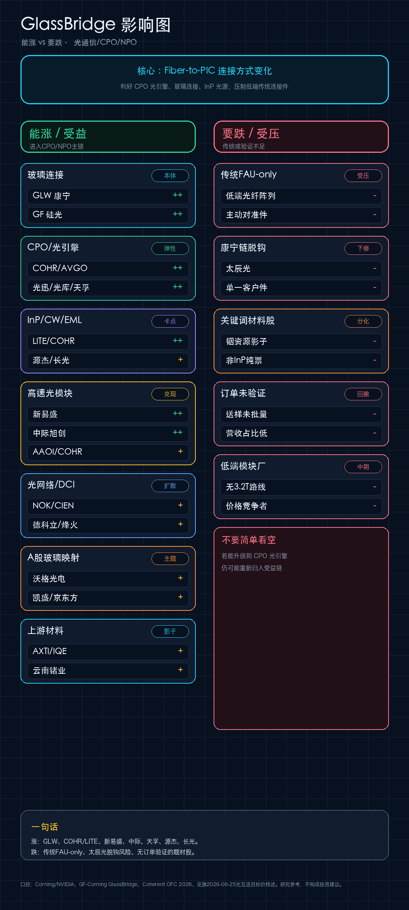

# 光通信主线汇总：GlassBridge / CPO / NPO / 3.2T

更新时间：2026-06-25 17:16

线上页面：https://csnpk.com/csn/

## 200字总结

光通信主线正在从“800G/1.6T 光模块周期”升级为“GlassBridge + CPO/NPO + InP 光源 + OCS/DCI”的系统性产业周期。GlassBridge 的关键不是替代激光器或光模块，而是解决 PIC 与光纤之间的高密度、低损耗连接问题，使 CPO/硅光光引擎更容易量产。短期收入兑现仍在新易盛、中际旭创、天孚通信等高端光模块/光器件公司；中期弹性在 COHR/LITE、源杰、长光华芯等 InP/CW/EML 光源瓶颈；系统扩散看 NOK、CIEN、德科立、烽火等光网络方向。需要谨慎的是传统 FAU-only、低端连接件、无客户验证的材料影子股，以及被提示与康宁脱钩风险的太辰光。

## 手机图

## 产业/主题定位

| 层级 | 产业位置 | 核心逻辑 | 代表公司 |
| --- | --- | --- | --- |
| 玻璃/光连接 | GlassBridge / Fiber-to-PIC 本体 | 解决 PIC 与光纤高密度、低损耗连接问题 | GLW、GF；A股映射：沃格、凯盛、京东方 |
| CPO/硅光/光引擎 | 连接方式变化后的核心平台 | GlassBridge 降低耦合难度，提升光引擎平台价值 | COHR、AVGO；光迅、光库、天孚 |
| InP/CW/EML 光源 | CPO/NPO 的上游瓶颈 | CPO 不生产光源，但会强化外置激光和 InP 需求 | LITE、COHR；源杰、长光华芯 |
| 高速光模块 | 短中期收入兑现层 | 800G/1.6T 继续放量，3.2T/NPO 抬高目标价想象 | 新易盛、中际旭创、AAOI、COHR |
| 光网络/DCI/OCS | 系统扩散层 | AI 集群跨园区互联、OCS、相干光、自主网络升级 | NOK、CIEN；德科立、烽火、光迅 |
| 传统FAU-only | 潜在受压层 | 若不能进入 CPO 光引擎，传统低端连接件议价力下降 | 太辰光脱钩风险、低端光纤阵列、主动对准件 |

## 股票影响分层

| 方向 | 优先级 | 股票/公司 | 判断 |
| --- | --- | --- | --- |
| 能涨 | 高 | GLW、COHR、LITE | 海外光连接、InP/CW、CPO 平台核心锚 |
| 能涨 | 高 | 新易盛、中际旭创、天孚通信 | A股高端光模块和 CPO 光器件主线，目标价被重新抬高 |
| 能涨 | 中高 | 源杰科技、长光华芯、光迅科技、光库科技 | 上游光源和光器件平台，关键看客户验证与收入占比 |
| 能涨 | 中 | NOK、CIEN、德科立、烽火通信 | 光网络、DCI、OCS、自主网络扩散线 |
| 能涨 | 主题 | 沃格光电、凯盛科技、京东方A | 玻璃基/玻璃波导映射，仍需订单和工艺验证 |
| 要跌/谨慎 | 高 | 太辰光、传统FAU-only | 花旗下调太辰光并提示与康宁脱钩风险，传统连接件需分化 |
| 要跌/谨慎 | 中 | 铟资源影子、非 InP 纯票、送样未批量公司 | 关键词弹性不等于产业纯度，缺客户验证容易回撤 |

## 核心产品阶段

| 方向 | 核心产品阶段 | 兑现速度 |
| --- | --- | --- |
| 800G/1.6T 光模块 | 规模放量期 | 财报和订单最容易先体现 |
| 3.2T / NPO | 客户认证期 → 试点部署期 | 目标价弹性强，但仍看客户导入节奏 |
| CPO 光引擎 | 客户认证期 | 决定天孚、光迅、光库等平台估值中枢 |
| GlassBridge / Fiber-to-PIC | 工程样机期 → 客户认证期 | 产业意义大，A股映射还偏主题验证 |
| CW/EML/InP 光源 | 客户认证期 → 规模放量期 | 源杰、长光华芯弹性取决于高速产品批量导入 |
| OCS/DCI/自主网络 | 试点部署期 → 规模放量期 | NOK/CIEN 和德科立/烽火偏系统扩散 |

## 交易结论

- 第一层：GLW、COHR/LITE、新易盛、中际旭创、天孚通信，是当前主线确定性最高的组合。
- 第二层：源杰科技、长光华芯、光迅科技、光库科技，是“光源/光器件平台”弹性层，关键看客户认证和收入占比。
- 第三层：NOK、CIEN、德科立、烽火通信，是光网络、DCI、OCS、自主网络扩散层。
- 谨慎层：传统 FAU-only、太辰光脱钩风险、铟资源影子股、无订单验证的题材股。

## 风险

- 半导体和光通信估值已明显抬升，短期交易拥挤。
- CPO/NPO 和 GlassBridge 仍处在客户认证与工程验证阶段，A股映射不能直接等同于海外订单。
- 花旗目标价属于卖方研究口径，不等同于实际股价路径。
- 本文为研究框架，不构成投资建议。
